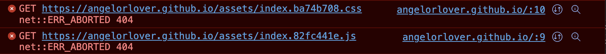
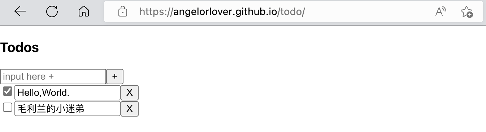

***

最近在学习[Solid.js](https://www.solidjs.com/),根据官方文档自己动手实现了一遍[Todo](https://www.solidjs.com/examples/todos)应用.

本地运行成功后尝试着将这个应用部署到GitHub Pages上看一下效果，根据部署文档[react-gh-pages
](https://github.com/gitname/react-gh-pages)一步步执行，最终部署上线，[链接在此](https://angelorlover.github.io/todo)。

然而访问[Demo](https://angelorlover.github.io/todo)之后发现，页面一片空白，此时打开控制台，发现控制台打印报错信息如下：

根据报错信息，发现**css**和**js**资源文件请求返回**404**错误,定位到源码分析资源配置如下：

>css：

    

>js

    <link rel="stylesheet" href="/assets/index.ba74b708.css">

可以发现，实际的资源请求链接不包含**todo**路径,分析可知资源配置路径出错。

由于本项目是用[Vite](https://cn.vitejs.dev/)工具编译的，不难推断出[Vite](https://cn.vitejs.dev/)打包配置文件缺少一个相对路径变量配置，查询官方[配置文档](https://cn.vitejs.dev/guide/static-deploy.html)，发现以下相关信息：

    GitHub Pages

    在 vite.config.js 中设置正确的 base。

    如果你要部署在 https://<USERNAME>.github.io/ 上，你可以省略 base 使其默认为 >>'/'。

    如果你要部署在 https://<USERNAME>.github.io/<REPO>/ 上，例如你的仓库地址为 >>https://github.com/<USERNAME>/<REPO>，那么请设置 base 为 '/<REPO>/'。

根据以上信息可知，我们需要在vite.config中配置base变量，完整配置代码如下：

    import { defineConfig } from 'vite';
    import solidPlugin from 'vite-plugin-solid';

    export default defineConfig({
    plugins: [solidPlugin()],
    base: "/todo",
    server: {
        port: 3000,
    },
    
    build: {
        target: 'esnext',
        outDir: 'build'
    },
    });
重新打包之后，此时访问[链接](https://angelorlover.github.io/todo)，一切加载正常，Over。

